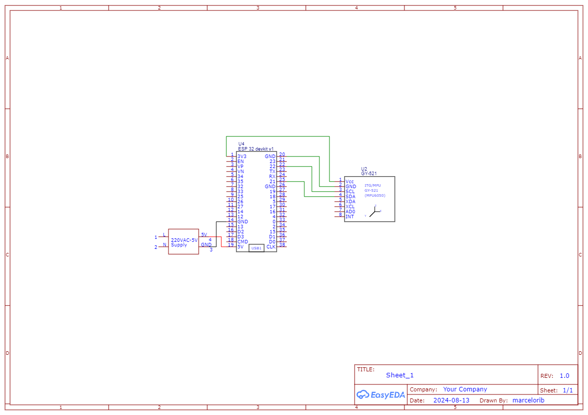

# Projeto Sistemas Embarcados IFPB

Este documento descreve as funções implementadas para a comunicação com um sensor MPU6050 via I2C utilizando o ESP32-IDF e a leitura de dados de aceleração, giroscópio e temperatura, além do cálculo de quaternions e ângulos de Euler.

## Requisitos

- 1x MCU, no caso escolhemos o ESP32
- 1x MPU6050
- Builder
  - ESP-IDF
- Bibliotecas
  - stdio.h
  - math.h
  - freertos/FreeRTOS.h
  - freertos/task.h
  - driver/i2c.h
  - esp_err.h
  - driver/gpio.h

## Portas utilizadas na ESP32 pelo MPU6050
- SDA - GPIO PIN 21
- SCL - GPIO PIN 22

## Funções Implementadas

### `esp_err_t imu_init(uint8_t devAddr, gpio_num_t sda_pin, gpio_num_t scl_pin)`

**Descrição**:  
Inicializa o sensor IMU configurando a comunicação I2C e verifica se o sensor está respondendo corretamente. A função também coloca o sensor em modo ativo, caso ele esteja em modo de sono.

**Parâmetros**:  
- `devAddr` - Endereço do dispositivo IMU no barramento I2C.
- `sda_pin` - Pino utilizado para o SDA (dados) do I2C.
- `scl_pin` - Pino utilizado para o SCL (clock) do I2C.

**Retorno**:  
- `ESP_OK` - Se a inicialização for bem-sucedida.
- `ESP_FAIL` - Se a instalação do driver I2C falhar.
- `ESP_ERR_NOT_FOUND` - Se o IMU não responder corretamente.

**Por que é feito**:  
A função é crucial para garantir que o sensor IMU esteja pronto para comunicação e que o ESP32 possa ler corretamente os dados do sensor.

### `esp_err_t imu_get_acceleration_data(AccelerationData *data)`

**Descrição**:  
Lê os dados brutos do acelerômetro do IMU e os converte para unidades de gravidade (g).

**Parâmetros**:  
- `data` - Ponteiro para a estrutura onde os dados de aceleração serão armazenados.

**Retorno**:  
- `ESP_OK` - Se a leitura for bem-sucedida.
- `ESP_FAIL` - Se ocorrer algum erro durante a leitura.

**Por que é feito**:  
A leitura dos dados de aceleração é fundamental para determinar o movimento e a orientação do dispositivo em relação ao solo.

### `esp_err_t imu_get_gyroscope_data(GyroscopeData *data)`

**Descrição**:  
Lê os dados brutos do giroscópio do IMU e os converte para valores de rotação em graus por segundo (°/s).

**Parâmetros**:  
- `data` - Ponteiro para a estrutura onde os dados do giroscópio serão armazenados.

**Retorno**:  
- `ESP_OK` - Se a leitura for bem-sucedida.
- `ESP_FAIL` - Se ocorrer algum erro durante a leitura.

**Por que é feito**:  
Os dados do giroscópio são usados para medir a velocidade de rotação do dispositivo em torno de seus eixos, o que é essencial para calcular a orientação e estabilizar movimentos.

### `esp_err_t imu_deinit()`

**Descrição**:  
Desinstala o driver I2C utilizado para se comunicar com o IMU, finalizando a comunicação com o sensor.

**Parâmetros**:  
- Nenhum.

**Retorno**:  
- `ESP_OK` - Se a desinstalação for bem-sucedida.

**Por que é feito**:  
É importante desinstalar o driver I2C para liberar recursos do sistema e garantir que o dispositivo esteja corretamente desligado quando não estiver em uso.

### `esp_err_t imu_read_data(IMUData *data)`

**Descrição**:  
Lê todos os dados do IMU, combinando as leituras de aceleração e giroscópio, e armazena os resultados na estrutura `IMUData`.

**Parâmetros**:  
- `data` - Ponteiro para a estrutura onde os dados completos do IMU serão armazenados.

**Retorno**:  
- `ESP_OK` - Se a leitura for bem-sucedida.
- `ESP_FAIL` - Se ocorrer algum erro durante a leitura.

**Por que é feito**:  
Essa função fornece uma leitura completa dos dados do IMU, facilitando a análise do movimento e da orientação em uma única operação.

### `esp_err_t imu_calculate_quaternion(const IMUData *data, Quaternion *quaternion)`

**Descrição**:  
Calcula um quaternion simplificado utilizando os dados de aceleração do IMU.

**Parâmetros**:  
- `data` - Ponteiro para os dados do IMU.
- `quaternion` - Ponteiro para a estrutura onde o quaternion será armazenado.

**Retorno**:  
- `ESP_OK` - Se o cálculo for bem-sucedido.

**Por que é feito**:  
Quaternions são utilizados para representar rotações no espaço tridimensional sem as desvantagens de ângulos de Euler, como gimbal lock. Essa função simplificada demonstra como converter dados de aceleração em um quaternion.

### `esp_err_t imu_calculate_euler_angles(const Quaternion *quaternion, EulerAngle *euler)`

**Descrição**:  
Calcula os ângulos de Euler (roll, pitch, yaw) com base no quaternion fornecido.

**Parâmetros**:  
- `quaternion` - Ponteiro para o quaternion calculado.
- `euler` - Ponteiro para a estrutura onde os ângulos de Euler serão armazenados.

**Retorno**:  
- `ESP_OK` - Se o cálculo for bem-sucedido.

**Por que é feito**:  
Ângulos de Euler são uma forma comum de expressar a orientação de um objeto no espaço tridimensional. Essa função converte quaternions em ângulos de Euler para aplicações que exigem essa representação.

### `void app_main()`

**Descrição**:  
Função principal do aplicativo que inicializa o IMU, lê continuamente os dados do sensor, calcula os quaternions e ângulos de Euler, e imprime os resultados no console.

**Por que é feito**:  
Essa função orquestra todo o fluxo do aplicativo, desde a inicialização do sensor até a leitura e processamento dos dados, garantindo que as informações sobre movimento e orientação sejam obtidas e exibidas corretamente.

## Conclusão

Esta documentação detalha as funções implementadas para a comunicação com o sensor IMU, leitura de dados, e processamento de informações para obter quaternions e ângulos de Euler. Essas funções são essenciais para aplicações que exigem monitoramento preciso de movimento e orientação.

## Esquemático

## Máquina de estados

## Diagrama de blocos 

## Protótipo

[Veja o projeto no Wokwi](https://wokwi.com/projects/406756562344382465)

## Autores

- [Antonio Roberto](https://github.com/antoniojunior2222)
- [Aryelson Gonçalves](https://github.com/aryelson1)
- [Clarissa Lucena](https://github.com/Clarissa-de-Lucena)
- [Felipe Bras](https://github.com/felipebrazfb333) 
- [Guilherme Santos](https://github.com/GuilhermexL)
- [Marcelo Ribeiro](https://github.com/Marcelo-RSilva)
